# Post-Disaster Land Rights & Relief on MST Blockchain (BhoomiSetu)

> **Preserving community consensus and immutable land claim evidence when physical records are lost, then using that verified proof to release government disaster relief quickly and without fraud.**  
> *Built for BMS College of Engineering 24-Hour Buildathon (September 28–29, 2026) | Team Harmony*

---

## 📌 Overview & Real-World Problem

When natural disasters (floods, fires, earthquakes) strike, physical land records, paper deeds, and local registry offices are frequently destroyed or rendered inaccessible. Two critical breakdowns occur simultaneously:
1. **Land rights are lost:** Displaced families face eviction, predatory land-grabbing, and prolonged legal dispute battles.
2. **Relief is blocked:** Government compensation schemes require verified ownership of affected parcels. Without records, payouts stall or are drained by fraudulent claims.

This project delivers a **decentralized, community-attested land rights registry** (`LandRegistry.sol`) coupled with an **automated disaster relief escrow** (`ReliefFund.sol`) deployed on the **MST Blockchain Testnet**.

> **Core Philosophy:** *Blockchain does not unilaterally decide who owns the land; it permanently preserves verifiable evidence of community consensus so no legitimate family is disenfranchised. Verified land proof is then the key that unlocks government relief.*

---

## 🔗 Live MST Testnet Deployed Contracts

| Smart Contract | Network | Live Address on MST Testnet | Deployment Tx Hash |
|---|---|---|---|
| **`LandRegistry.sol`** | MST Testnet | `0x9A587a9a4b990bb14Cd00D6432487271f00c2A5c` | `0x3dd8689e5b428bde63bf806edbdfcbdfaf759dd7082b8ff15d4afe0cc5201892` |
| **`ReliefFund.sol`** | MST Testnet | `0x41241011dE47C4eb30dFcc45097ceD1f73a7Bd25` | `0x4af4bce5a3349416bd697a7da55958d5a87b17be2494d00fba4cb6e6136c540c` |

- **RPC URL:** `https://testnetrpc.mstblockchain.com`
- **Chain ID:** `91562037` (`0x5752035`)
- **Faucet:** `https://faucet.mstblockchain.com`

---

## 🏛️ System Architecture

The system connects a **Vite React** frontend, a **Node.js/Express** backend with geospatial overlap detection (Turf.js) and relief eligibility engine, **MongoDB Atlas** for off-chain evidence, and smart contracts deployed on the **MST Testnet**.

```mermaid
flowchart TD
    subgraph Frontend["Frontend (Vite + React)"]
        direction TB
        CF["Claim Form<br/><small>Map + GPS</small>"]
        MV["Map View<br/><small>Claim markers</small>"]
        GD["Gov Dashboard<br/><small>Reliefs + payouts</small>"]
        VP["Verify Page<br/><small>Public /verify/:id</small>"]
    end

    subgraph Backend["Backend (Express + Node.js)"]
        direction TB
        PC["POST /claims<br/><small>Create claim</small>"]
        PA["POST /claims/:id/attest<br/><small>Multi-sig vote</small>"]
        GC["GET /claims<br/><small>Query all claims</small>"]
        RL["POST /reliefs<br/><small>Declare relief event</small>"]
        EL["Eligibility engine<br/><small>Zone + Verified check</small>"]
        AS["POST /claims/:id/assess<br/><small>Damage level</small>"]
        AP["POST /claims/:id/approve-payout<br/><small>Officer approval</small>"]
        CJ["chain.js<br/><small>Contract layer</small>"]
        OD["Overlap detection<br/><small>Compare coordinates (Turf.js)</small>"]
        DR["Dispute resolver<br/><small>Flag for human review</small>"]
    end

    subgraph Mongo["MongoDB Atlas"]
        direction TB
        CL["claims + images<br/><small>Off-chain evidence</small>"]
        RP["reliefs + payouts<br/><small>Off-chain records</small>"]
    end

    subgraph Blockchain["Blockchain (MST Testnet)"]
        direction TB
        CC["createClaim()<br/><small>Proof of existence</small>"]
        AT["attest()<br/><small>Role-weighted vote</small>"]
        DP["dispute()<br/><small>Flag conflict</small>"]
        GT["getClaim()<br/><small>Read immutable state</small>"]
        CR["createRelief()<br/><small>Fund a relief event</small>"]
        AC["assess() / approvePayout()<br/><small>Damage + 2 officers</small>"]
        RE["release()<br/><small>Pay once, if Verified</small>"]
        RPC["MST Testnet RPC: https://testnetrpc.mstblockchain.com"]
    end

    CF --> PC
    MV --> GC
    GD --> RL
    GD --> EL
    GD --> AS
    GD --> AP
    VP --> CJ

    PC --> OD
    OD --> CC
    PC --> CL
    PA --> AT
    DR --> DP
    CJ --> GT
    GC -.-> DR

    RL --> CR
    RL --> RP
    EL --> GT
    EL --> RP
    AS --> AC
    AP --> AC
    AC --> RE

    classDef fe fill:#133e68,stroke:#3b82f6,stroke-width:1px,color:#ffffff;
    classDef be fill:#0d5c46,stroke:#10b981,stroke-width:1px,color:#ffffff;
    classDef db fill:#3b1f6b,stroke:#a78bfa,stroke-width:1px,color:#ffffff;
    classDef bc fill:#6b3f0a,stroke:#f59e0b,stroke-width:1px,color:#ffffff;
    classDef rpc fill:#4a2800,stroke:#d97706,stroke-width:1px,color:#fbbf24;

    class CF,MV,GD,VP fe;
    class PC,PA,GC,RL,EL,AS,AP,CJ,OD,DR be;
    class CL,RP db;
    class CC,AT,DP,GT,CR,AC,RE bc;
    class RPC rpc;
```



---

## 🔒 Privacy Architecture: On-Chain vs. Off-Chain

To strictly comply with privacy standards and prevent storing personally identifiable information (PII) on a public ledger:

| On-Chain (`LandRegistry.sol`, `ReliefFund.sol`) | Off-Chain (MongoDB Atlas / Backend) |
|---|---|
| `ownerHash` = `SHA-256(NationalID + Salt)` | Owner full name, phone number, government ID |
| `evidenceHash` = `SHA-256(Photos + GeoJSON + Witnesses)` | Original deed photos, ground survey images |
| Reference Latitude & Longitude (`latE6`, `lonE6` in micro-degrees) | Full boundary polygon coordinates |
| Community Trust Score & Status (`Pending` / `Verified` / `Disputed`) | Dispute notes, witness written statements |
| Attestation logs (Attester address, role, score) | Human-readable attester profiles |
| **Relief event: zone hash, per-claim cap, budget** | **Full zone polygon, scheme description** |
| **Damage level and `damageEvidenceHash`** | **Field assessment photos and surveyor notes** |
| **Payout status, amount, beneficiary address, tx hash** | **Beneficiary contact and bank mapping** |

---

## ⭐ Key Features

1. **Proof of Existence on MST Testnet**
   - High-throughput, low-fee smart contract transactions create tamper-evident claim timestamps.
2. **Trust-Weighted Multi-Party Attestation**
   - Consensus requires weighted scores from community actors:
     - **Neighbor:** `+1` weight
     - **Village Leader:** `+3` weight
     - **Accredited NGO:** `+3` weight
   - Claims transition automatically from `Pending` (0) to **`Verified`** (1) upon reaching **Score ≥ 5**.
3. **Automated Geospatial Overlap Detection**
   - Backend compares candidate claim polygons using Turf.js. Conflicting submissions automatically trigger `dispute()`, setting claim status to `Disputed` (2) and freezing payouts on-chain.
4. **Relief & Reimbursement Escrow (`ReliefFund.sol`)**
   - Enables government admins to lock relief funds on-chain.
   - Strict anti-fraud rules: payout requires prior claim verification, accredited damage assessment, and matching dual-officer approval.
5. **Public QR Proof Certificate (`/verify/:id`)**
   - Generates a verifiable QR code linking directly to on-chain state, allowing emergency aid workers and insurers to confirm land rights and payout records immediately.

---

## ⚙️ Tech Stack

- **Smart Contracts:** Solidity `^0.8.20`, deployed on MST Testnet (`LandRegistry.sol`, `ReliefFund.sol`)
- **Blockchain Client:** `ethers.js` v6, `@mstblockchain/mst-sdk`, BridgeKey Wallet
- **Backend API:** Node.js, Express v5, `fs-extra`, `dotenv`, Turf.js (geospatial calculations)
- **Database:** MongoDB Atlas (`mongodb` driver v7) with synchronized fallback cache
- **Frontend:** React, Vite, Leaflet Maps, HTML5, CSS3
- **Deployment:** Vercel Monorepo (`vercel.json`) + MST Testnet RPC

---

## 🚀 Local Development Setup

### 1. Installation
```bash
git clone https://github.com/prathamshetty18/teamharmonybms.git
cd teamharmonybms
npm install
```

### 2. Environment Configuration (`.env`)
Create a `.env` file in the root directory:
```env
RPC_URL=https://testnetrpc.mstblockchain.com
CONTRACT_ADDRESS=0x9A587a9a4b990bb14Cd00D6432487271f00c2A5c
RELIEF_CONTRACT_ADDRESS=0x41241011dE47C4eb30dFcc45097ceD1f73a7Bd25
PORT=5000
MONGO_URI=mongodb://127.0.0.1:27017/harmonybms
```

### 3. Running Locally

#### **A. Run Blockchain Test Suite**
```bash
# Run in Mock Mode (22/22 Tests Passing)
CHAIN_MOCK=1 npm run test:chain

# Run against MST Testnet
npm run test:chain
```

#### **B. Start Backend API Server**
```bash
cd backend
npm install
npm start
# Express Server runs on http://localhost:5000
```

#### **C. Start Frontend App**
```bash
cd frontend
npm install
npm run dev
# Vite Dev Server runs on http://localhost:3000
```

---

## 🌐 Deployment to Vercel

The repository includes a production-ready [`vercel.json`](./vercel.json) configuration for instant monorepo deployment:

### **Option 1: Vercel GitHub Integration (Automatic CI/CD)**
1. Connect your repository `prathamshetty18/teamharmonybms` on [vercel.com](https://vercel.com/new).
2. Select branch: **`backend`**.
3. Vercel automatically detects `vercel.json` to deploy:
   - **Frontend App**: Vite React (`frontend/`)
   - **Backend API**: Serverless Express Node (`backend/server.js`)

### **Option 2: Vercel CLI**
```bash
npx vercel
```

---

## 📡 REST API Reference

Primary identifier across all endpoints is the on-chain `claimId`. Monetary amounts are handled strictly as wei integer strings.

| Method | Endpoint | Description | Request Body / Params | On-Chain Function |
|---|---|---|---|---|
| `POST` | `/claims` | Submit parcel claim (runs overlap check) | `{ ownerName, nationalId, polygon, parcelAreaAcres, beneficiaryAddress }` | `chain.createClaim()` |
| `GET` | `/claims` | List all land parcels for map markers | None | Read from Atlas |
| `GET` | `/claims/:id` | Parcel details, attestations, & dispute status | URL param `:id` | `chain.getClaim()` |
| `POST` | `/claims/:id/attest` | Submit community attestation | `{ role, name, signer }` | `chain.attest()` |
| `POST` | `/claims/:id/dispute` | Flag parcel boundary dispute | `{ reason }` | `chain.dispute()` |
| `POST` | `/claims/:id/resolve` | Admin/arbiter resolves dispute | `{ restore: true \| false }` | `chain.resolveDispute()` |
| `GET` | `/verify/:id` | Public QR proof view | URL param `:id` | Re-verifies `evidenceHash` |
| `POST` | `/reliefs` | Declare disaster relief scheme | `{ name, zonePolygon, ratePerAcre, maxPerClaimWei, budgetWei }` | `chain.createRelief()` |
| `GET` | `/reliefs` | List active relief schemes | None | Read from Atlas |
| `GET` | `/reliefs/:id/eligible` | Verified in-zone eligible claims | URL param `:id` | `isEligible()`, `scaleToBudget()` |
| `POST` | `/claims/:id/assess` | Record damage assessment | `{ reliefId, damageLevel, damageEvidenceHash }` | `chain.assess()` |
| `POST` | `/claims/:id/approve-payout` | Dual-officer approval | `{ reliefId, officer, amount, beneficiary }` | `chain.approvePayout()` |
| `POST` | `/claims/:id/release-payout` | Release MST Testnet compensation | `{ reliefId }` | `chain.release()` |
| `GET` | `/claims/:id/payout` | View payout record & wei amount | URL param `:id` | `chain.getPayout()` |

---

## 👥 Team Harmony (BMSCE Buildathon 2026)

| Member | Role | Area Owned & Responsibilities |
|---|---|---|
| **Person A** | Blockchain & Contract Lead | Smart contracts (`LandRegistry.sol`, `ReliefFund.sol`), `chain.js`, multi-wallet role architecture, `routes/chainRoutes.js`, `routes/reliefRoutes.js`, `scripts/testChain.js` |
| **Person B** | Data & Logic Lead | Express backend, MongoDB Atlas layer, Turf.js overlap algorithm, SDRF parametric scoring, eligibility engine |
| **Person C** | Frontend Lead | Leaflet map interface, claim creation workflow, attestation UI, QR certificate view, Government dashboard |
| **Person D** | Product & Demo Lead | Problem statement, demo script, verification checklist, documentation |

---

## 📄 License & Deliverables

- **Submission Log:** See [SUBMISSION.md](./SUBMISSION.md) for live contract addresses, deployment hashes, and on-chain verification proofs.
- **Design Specifications:** See [design.md](./design.md) for technical sitemap and data architecture.
- **License:** MIT License. Built for social impact and post-disaster land resilience.
