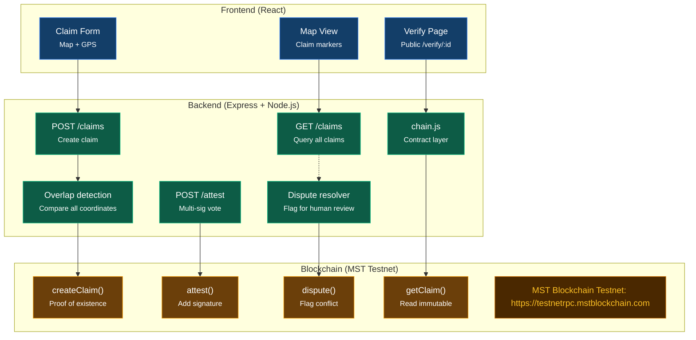

# Post-Disaster Land Rights on MST Blockchain

> **Preserving community consensus and immutable land claim evidence when physical records are lost in crisis.**  
> *Built for BMS College of Engineering 24-Hour Buildathon (September 28–29, 2026)*

---

## 📌 Overview & Real-World Problem

When natural disasters (floods, fires, earthquakes) strike, physical land records, paper deeds, and local registry offices are frequently destroyed or rendered inaccessible. Displaced families face eviction, predatory land-grabbing, and prolonged bureaucratic delays when attempting to reclaim their property.

This project delivers a **decentralized, community-attested land rights registry** deployed on the **MST Blockchain Testnet**. 

> **Core Philosophy:** *Blockchain does not unilaterally decide who owns the land; it permanently preserves verifiable evidence of community consensus so no legitimate family is disenfranchised.*

---

## 🏛️ System Architecture & Flowchart

The system connects a lightweight **React** frontend, a **Node.js/Express** backend with geospatial overlap detection, and smart contracts deployed on the **MST Testnet**.

### Architecture Diagram


### Flowchart Breakdown (Mermaid)



---

## 🔒 Privacy Architecture: On-Chain vs. Off-Chain

To adhere to privacy standards and avoid storing sensitive personally identifiable information (PII) on a public ledger:

| On-Chain (`LandRegistry.sol`) | Off-Chain (Secure Backend / Storage) |
|---|---|
| `ownerHash` = `SHA-256(NationalID + Salt)` | Owner full name, phone number, government ID |
| `evidenceHash` = `SHA-256(Photos + GeoJSON + Witnesses)` | Original deed photos, ground survey images |
| Reference Latitude & Longitude (`latE6`, `lonE6`) | Full polygon boundary coordinates |
| Community Trust Score & Status (`Pending` / `Verified` / `Disputed`) | Dispute notes, witness written statements |
| Attestation logs (Attester address, role, score) | Human-readable attester display profiles |

---

## ⭐ Key Features

1. **Proof of Existence on MST Testnet**
   - High-throughput, low-fee smart contract transactions on the MST network create tamper-evident claim timestamps.
2. **Trust-Weighted Multi-Party Attestation**
   - Consensus requires weighted scores from diverse community actors:
     - **Neighbor:** `+1` weight
     - **Village Leader:** `+3` weight
     - **Accredited NGO:** `+3` weight
   - Claims transition automatically from `Pending` to **`Verified`** once reaching **Score ≥ 5**.
3. **Automated Geospatial Overlap Detection**
   - Backend compares candidate claim polygons against verified registries using coordinate intersection algorithms.
   - Conflicting submissions automatically route to the **Dispute Resolver** for human arbitration.
4. **Public QR Proof Certificate (`/verify/:id`)**
   - Generates a cryptographically verifiable QR code linking directly to on-chain state, allowing emergency aid workers, relief agencies, and insurers to confirm land rights immediately.

---

## ⚙️ Tech Stack

- **Smart Contract:** Solidity `^0.8.0`, deployed on MST Testnet
- **Blockchain Client & SDK:** `@mstblockchain/mst-sdk`, `ethers.js` v6, BridgeKey Wallet
- **Backend API:** Node.js, Express, `fs-extra`, `dotenv`, Turf.js (geospatial calculations)
- **Frontend:** React, Leaflet Maps (interactive boundary drawing & GPS), HTML5, CSS3

---

## 🔗 Network & Smart Contract Specifications

- **Network:** MST Blockchain Testnet
- **RPC URL:** `https://testnetrpc.mstblockchain.com`
- **Smart Contract:** `contracts/LandRegistry.sol`
- **Compiled Artifacts:** `build/LandRegistry.json`

### Smart Contract Methods (`LandRegistry.sol`)

| Function | Signature | Description |
|---|---|---|
| `createClaim` | `(bytes32 ownerHash, bytes32 evidenceHash, uint32 latE6, uint32 lonE6)` | Initializes a land record on-chain and emits `ClaimCreated`. |
| `attest` | `(uint256 claimId, uint8 role)` | Registers role-weighted signature and triggers status update. |
| `dispute` | `(uint256 claimId)` | Flags a conflicting claim for manual mediation. |
| `resolveDispute` | `(uint256 claimId, bool restore)` | Authorized admin/arbiter resolves disputed claims. |
| `getClaim` | `(uint256 claimId)` | Gasless `view` method returning claim hashes, coordinates, score, and status. |

---

## 🚀 Quickstart & Setup Guide

### 1. Prerequisites
- Node.js (v18.x or v20.x recommended)
- Git
- Funded MST Testnet account (via MST Faucet)

### 2. Installation
```bash
git clone https://github.com/prathamshetty18/teamharmonybms.git
cd teamharmonybms
npm install
```

### 3. Environment Configuration
Create a `.env` file in the root directory (never commit this file):
```env
RPC_URL=https://testnetrpc.mstblockchain.com
PRIVATE_KEY=0xYOUR_TESTNET_PRIVATE_KEY
RECIPIENT=0xBRIDGEKEY_TEST_RECIPIENT_ADDRESS
CONTRACT_ADDRESS=0xAUTO_POPULATED_AFTER_DEPLOY
PORT=5000
```

### 4. Smart Contract Lifecycle Scripts
```bash
# 1. Generate or verify your wallet
npm run wallet

# 2. Check testnet connection and balance
npm run balance

# 3. Compile the Solidity contract
npm run compile

# 4. Deploy LandRegistry to MST Testnet (auto-updates .env and SUBMISSION.md)
npm run deploy

# 5. Run end-to-end claim interaction demo
npm run demo
```

---

## 📡 REST API Reference

| Method | Endpoint | Description | On-Chain Interaction |
|---|---|---|---|
| `POST` | `/claims` | Submit a new parcel claim with boundary & owner hash | `createClaim()` |
| `GET` | `/claims` | List all registered parcels (for Leaflet map markers) | Off-chain DB / Cache |
| `GET` | `/claims/:id` | Fetch parcel details, attestation history, & state | `getClaim()` |
| `POST` | `/claims/:id/attest` | Submit community attestation (`{ role, name }`) | `attest()` |
| `POST` | `/claims/:id/dispute` | Flag parcel boundary dispute (`{ reason }`) | `dispute()` |
| `GET` | `/verify/:id` | Public verification view linked via QR certificate | `getClaim()` |

---

## 👥 Team Harmony (BMSCE 2026)

| Member | Role | Key Responsibilities |
|---|---|---|
| **Srujan** | Blockchain Lead | Smart contracts (`LandRegistry.sol`), deployment, MST SDK integration, tx verification |
| **Team Member B** | Backend / API Lead | Express server, polygon overlap algorithm, REST endpoints, `chain.js` contract layer |
| **Team Member C** | Frontend Lead | Leaflet map interface, claim creation workflow, attestation UI, QR certificate view |
| **Team Member D** | Product & Demo Lead | Problem statement, demo script, verification checklist, documentation |

---

## 📄 License & Hackathon Deliverables

- **Submission Log:** See `SUBMISSION.md` for live contract addresses, deployment transaction hashes, and proof-of-claim execution receipts.
- **License:** MIT License. Built for social impact and disaster resilience.
