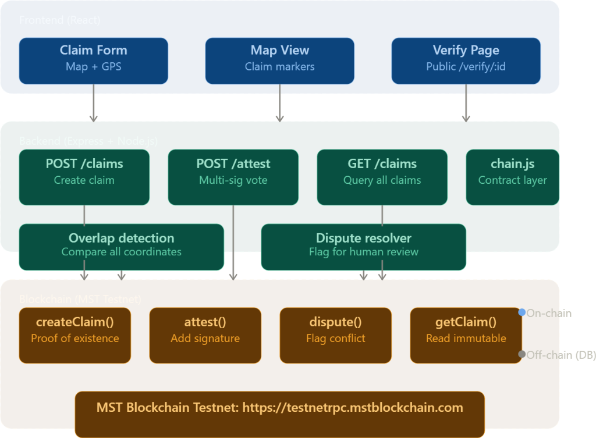
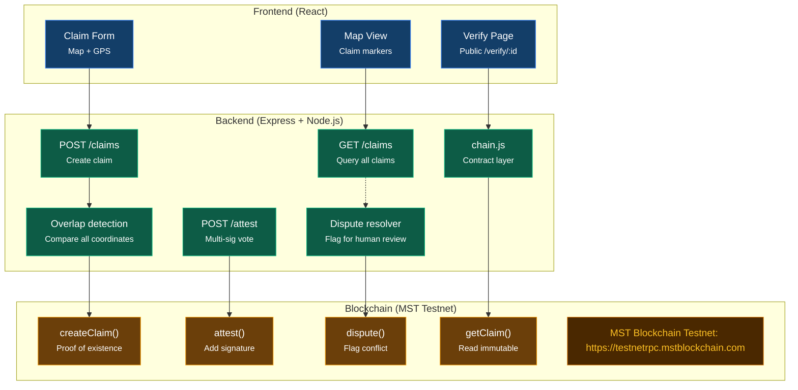

# Post-Disaster Land Rights on MST Blockchain

> **Preserving community consensus and immutable land claim evidence when physical records are lost in crisis.**  
> *Built for BMS College of Engineering 24-Hour Buildathon (September 28–29, 2026)*

---

## 📌 Overview & Real-World Problem

When natural disasters (floods, fires, earthquakes) strike, physical land records, paper deeds, and local registry offices are frequently destroyed or rendered inaccessible. Displaced families face eviction, predatory land-grabbing, and prolonged bureaucratic delays when attempting to reclaim their property.

This project delivers a **decentralized, community-attested land rights registry** deployed on the **MST Blockchain Testnet**. 

> **Core Philosophy:** *Blockchain does not unilaterally decide who owns the land; it permanently preserves verifiable evidence of community consensus so no legitimate family is disenfranchised.*

---

## 🏛️ System Architecture & Flowchart

The system connects a lightweight **React** frontend, a **Node.js/Express** backend with geospatial overlap detection, and smart contracts deployed on the **MST Testnet**.

### Architecture Diagram


### Flowchart Breakdown (Mermaid)



---

## 🔒 Privacy Architecture: On-Chain vs. Off-Chain

To adhere to privacy standards and avoid storing sensitive personally identifiable information (PII) on a public ledger:

| On-Chain (`LandRegistry.sol`) | Off-Chain (Secure Backend / Storage) |
|---|---|
| `ownerHash` = `SHA-256(NationalID + Salt)` | Owner full name, phone number, government ID |
| `evidenceHash` = `SHA-256(Photos + GeoJSON + Witnesses)` | Original deed photos, ground survey images |
| Reference Latitude & Longitude (`latE6`, `lonE6`) | Full polygon boundary coordinates |
| Community Trust Score & Status (`Pending` / `Verified` / `Disputed`) | Dispute notes, witness written statements |
| Attestation logs (Attester address, role, score) | Human-readable attester display profiles |

---

## ⭐ Key Features

1. **Proof of Existence on MST Testnet**
   - High-throughput, low-fee smart contract transactions on the MST network create tamper-evident claim timestamps.
2. **Trust-Weighted Multi-Party Attestation**
   - Consensus requires weighted scores from diverse community actors:
     - **Neighbor:** `+1` weight
     - **Village Leader:** `+3` weight
     - **Accredited NGO:** `+3` weight
   - Claims transition automatically from `Pending` to **`Verified`** once reaching **Score ≥ 5**.
3. **Automated Geospatial Overlap Detection**
   - Backend compares candidate claim polygons against verified registries using coordinate intersection algorithms.
   - Conflicting submissions automatically route to the **Dispute Resolver** for human arbitration.
4. **Public QR Proof Certificate (`/verify/:id`)**
   - Generates a cryptographically verifiable QR code linking directly to on-chain state, allowing emergency aid workers, relief agencies, and insurers to confirm land rights immediately.

---

## ⚙️ Tech Stack

- **Smart Contract:** Solidity `^0.8.0`, deployed on MST Testnet
- **Blockchain Client & SDK:** `@mstblockchain/mst-sdk`, `ethers.js` v6, BridgeKey Wallet
- **Backend API:** Node.js, Express, `fs-extra`, `dotenv`, Turf.js (geospatial calculations)
- **Frontend:** React, Leaflet Maps (interactive boundary drawing & GPS), HTML5, CSS3

---

## 🔗 Network & Smart Contract Specifications

- **Network:** MST Blockchain Testnet
- **RPC URL:** `https://testnetrpc.mstblockchain.com`
- **Smart Contract:** `contracts/LandRegistry.sol`
- **Compiled Artifacts:** `build/LandRegistry.json`

### Smart Contract Methods (`LandRegistry.sol`)

| Function | Signature | Description |
|---|---|---|
| `createClaim` | `(bytes32 ownerHash, bytes32 evidenceHash, uint32 latE6, uint32 lonE6)` | Initializes a land record on-chain and emits `ClaimCreated`. |
| `attest` | `(uint256 claimId, uint8 role)` | Registers role-weighted signature and triggers status update. |
| `dispute` | `(uint256 claimId)` | Flags a conflicting claim for manual mediation. |
| `resolveDispute` | `(uint256 claimId, bool restore)` | Authorized admin/arbiter resolves disputed claims. |
| `getClaim` | `(uint256 claimId)` | Gasless `view` method returning claim hashes, coordinates, score, and status. |

---

## 🚀 Quickstart & Setup Guide

### 1. Prerequisites
- Node.js (v18.x or v20.x recommended)
- Git
- Funded MST Testnet account (via MST Faucet)

### 2. Installation
```bash
git clone https://github.com/prathamshetty18/teamharmonybms.git
cd teamharmonybms
npm install
```

### 3. Environment Configuration
Create a `.env` file in the root directory (never commit this file):
```env
RPC_URL=https://testnetrpc.mstblockchain.com
PRIVATE_KEY=0xYOUR_TESTNET_PRIVATE_KEY
RECIPIENT=0xBRIDGEKEY_TEST_RECIPIENT_ADDRESS
CONTRACT_ADDRESS=0xAUTO_POPULATED_AFTER_DEPLOY
PORT=5000
```

### 4. Smart Contract Lifecycle Scripts
```bash
# 1. Generate or verify your wallet
npm run wallet

# 2. Check testnet connection and balance
npm run balance

# 3. Compile the Solidity contract
npm run compile

# 4. Deploy LandRegistry to MST Testnet (auto-updates .env and SUBMISSION.md)
npm run deploy

# 5. Run end-to-end claim interaction demo
npm run demo
```

---

---

## 🛠️ Backend Setup & Data Layer (Person B — Data & Logic)

The Harmony BMS backend provides the high-performance off-chain data layer, geospatial boundary conflict engine, eligibility and budget scaling algorithms, and REST API connecting the React frontend to the MST Blockchain smart contracts.

### 1. Backend Architecture & Technologies
- **Runtime & Web Framework:** Node.js (v18+), Express v5
- **Database Layer:** MongoDB Atlas via the official `mongodb` driver (`^7.6.0`) with automatic in-memory synchronized seed cache.
- **Geospatial Processing:** Turf.js (`@turf/turf` v7) for polygon intersections, boundary overlap percentages, and point-in-polygon verification.
- **Cryptographic Hashing:** Node.js native `crypto` SHA-256 for `ownerHash` (`bytes32`), `evidenceHash` (`bytes32`), and `zoneHash` (`bytes32`).
- **Precision Monetary Math:** Pure JavaScript `BigInt` for wei arithmetic (zero floating-point precision loss).
- **Multipart Uploads:** Multer with unique timestamped disk storage in `backend/uploads/`.
- **Central Error Handling:** Standardized format `{ "error": "..." }` across all validation and database exceptions.

### 2. Backend Installation & Running

```bash
# Navigate to the backend directory
cd backend

# Install dependencies
npm install

# Configure environment variables in backend/.env
# PORT=5000
# MONGO_URI=mongodb+srv://<user>:<password>@cluster.mongodb.net/harmonybms
# RPC_URL=https://testnetrpc.mstblockchain.com

# Seed database with demonstration parcels & relief schemes
npm run seed
# or from root:
node scripts/seed.js

# Start Express server (runs on port 5000 by default)
npm start

# Run all 5 unit & integration test suites (100% passing)
npm test
```

### 3. Demonstration Seed Data (`scripts/seed.js`)
Running `node scripts/seed.js` or `npm run seed` initializes MongoDB Atlas with:
- **Parcel #1 (Ramesh Gowda):** Status `Verified` (Score: 5 from 2 neighbors + 1 village leader), 2.0 acres in Basavanagudi South, inside flood relief zone. Payout status `Paid` (2.0 MST).
- **Parcel #2 (Lakshmi Bai):** Status `Pending` (Score: 2), 1.8 acres, inside flood relief zone. Ready for additional community attestations.
- **Parcel #3 (Anand Kumar):** Status `Disputed` — **Overlaps Parcel #1 by 42%**, demonstrating automated collision detection by Turf.js, auto-calling `chain.dispute()`, and payout freeze pending human arbitration.
- **Parcel #4 (Smt. Sunitha Rao):** Status `Verified` (Score: 6), 2.2 acres, inside flood relief zone. Payout status `Assessed` (1.1 MST).
- **Disaster Relief Event (`relief_flood_2026`):** Karnataka SDRF Flood Relief Scheme 2026 covering Basavanagudi South basin with 100 MST budget, 1 MST/acre rate, and 5 MST max cap.

---

## 📡 REST API Reference (All 14 Endpoints)

Primary identifier across all collections is the on-chain `claimId`. Monetary amounts are represented strictly as wei integer strings. Coordinate arrays follow GeoJSON `[lon, lat]` standard order.

| # | Method | Endpoint | Description | Request Body / Parameters | On-Chain Function |
|---|---|---|---|---|---|
| **1** | `POST` | `/claims` | Submit parcel claim (runs overlap check) | Multipart or JSON `{ ownerName, nationalId, polygon, parcelAreaAcres, notes, beneficiaryAddress }` | `chain.createClaim(ownerHash, evidenceHash, lat, lon)` |
| **2** | `GET` | `/claims` | List all land parcels for map markers | None | Read from Atlas / Cache |
| **3** | `GET` | `/claims/:id` | Parcel details, attestations, & dispute status | URL param `:id` (claimId) | Merged with `chain.getClaim(claimId)` |
| **4** | `POST` | `/claims/:id/attest` | Submit role-weighted community attestation | `{ role: "Neighbor" \| "Village Leader" \| "Accredited NGO", attesterName, notes }` | `chain.attest(claimId, weight)` |
| **5** | `POST` | `/claims/:id/dispute` | Flag parcel boundary dispute | `{ reason, disputerName, overlappingClaimId }` | `chain.dispute(claimId)` |
| **6** | `POST` | `/claims/:id/resolve` | Admin / arbiter resolves dispute | `{ restore: true \| false, resolutionNotes, arbiterAddress }` | `chain.resolveDispute(claimId, restore)` |
| **7** | `GET` | `/verify/:id` | Public QR certificate view (re-checks evidence hash) | URL param `:id` (claimId) | Validates on-chain `evidenceHash` |
| **8** | `POST` | `/reliefs` | Declare disaster relief event & compute `zoneHash` | `{ name, zone, ratePerAcre, maxPerClaim, budget, disasterType }` | `chain.createRelief(zoneHash, maxPerClaim, budget)` |
| **9** | `GET` | `/reliefs` | List all active relief schemes | None | Read from Atlas `reliefs` |
| **10** | `GET` | `/reliefs/:id/eligible` | Verified in-zone claims, damage levels, & scaled payouts | URL param `:id` (reliefId) | Filters `isEligible()`, runs `scaleToBudget()` |
| **11** | `POST` | `/claims/:id/assess` | Field assessor records damage criteria | `{ reliefId, answers: { depth, structure, duration, type, contents }, confirmedAreaAcres }` | Stores assessment in Atlas `payouts` |
| **12** | `POST` | `/claims/:id/approve-payout` | Government officer dual-approval | `{ reliefId, officer: "Officer_Name" }` | Advances status to `Approved` upon 2 approvals |
| **13** | `POST` | `/claims/:id/release-payout` | Release compensation on MST Testnet | `{ reliefId }` | Emits `PayoutReleased`, deducts `remainingBudget` |
| **14** | `GET` | `/claims/:id/payout` | View payout record & wei compensation | URL param `:id` (claimId) | Read from Atlas `payouts` |
| **—** | `POST` | `/claims/check-overlap` | Pre-flight live Leaflet map collision check | `{ polygon: GeoJSON, excludeClaimId? }` | Pure Turf.js intersection analysis |
| **—** | `GET` | `/disputes` | List all currently disputed parcels | None | Queries claims where `status == "Disputed"` |

---

## 🧪 Postman & cURL Collections

### 1. Postman Collection
Import [`Harmony_BMS.postman_collection.json`](./Harmony_BMS.postman_collection.json) or [`backend/postman_collection.json`](./backend/postman_collection.json) directly into Postman, Insomnia, Thunder Client, or Bruno.
- Configured with environment variable `{{baseUrl}} = http://localhost:5000`.
- Contains all 14 endpoints pre-configured with sample payloads, query parameters, and documentation.

### 2. cURL Collection
Execute the ready-to-run shell script [`backend/curl_commands.sh`](./backend/curl_commands.sh):
```bash
chmod +x backend/curl_commands.sh
./backend/curl_commands.sh
```

Or execute individual requests:
```bash
# 1. Check all registered claims
curl -X GET http://localhost:5000/claims

# 2. Test pre-flight overlap on Leaflet map
curl -X POST http://localhost:5000/claims/check-overlap \
  -H "Content-Type: application/json" \
  -d '{"polygon": {"type": "Polygon", "coordinates": [[[77.562, 12.941],[77.564, 12.941],[77.564, 12.943],[77.562, 12.943],[77.562, 12.941]]]}}'

# 3. View public QR verification view
curl -X GET http://localhost:5000/verify/1

# 4. View eligible claims under flood relief scheme
curl -X GET http://localhost:5000/reliefs/relief_flood_2026/eligible
```

---

## 🧩 Core Backend Logic Modules

1. **Geospatial Overlap Engine ([`backend/overlap.js`](./backend/overlap.js))**:
   - `findOverlaps(newPolygon, existingClaims)`: Detects boundary collisions using Turf.js.
   - Ignores shared boundary edges via 0.5% threshold filter.
   - Generates standardized dispute reasons and administrative audit notes.
2. **Eligibility & Relief Engine ([`backend/eligibility.js`](./backend/eligibility.js))**:
   - `damageLevel(disasterType, answers)`: Data-driven damage scoring profiles for floods and earthquakes based on SDRF schedules.
   - `isEligible(claim, relief)`: Verified, not Disputed, reference point in zone.
   - `computeAmount(claim, relief, damageLevel)`: Pure `BigInt` wei arithmetic capped at `maxPerClaim`.
   - `scaleToBudget(amounts, budgetWei)`: Proportional scaling guaranteeing total disbursements never exceed escrowed budget.
3. **Relief Module ([`backend/relief.js`](./backend/relief.js))**:
   - `createReliefRecord()`: Validates wei parameters and computes `zoneHash` (`bytes32`).
   - `getEligibleClaimsForRelief()`: Produces full dashboard summary with eligible claims, damage scores, scaled amounts, and budget shortfall.
   - `getPayoutRecord()` and `getVerificationCertificate()`.
4. **Data Store Layer ([`backend/store.js`](./backend/store.js))**:
   - Dual-persistence engine: queries MongoDB Atlas when connected; seamlessly falls back to synchronized in-memory cache if MongoDB is offline.

---

## 👥 Team Harmony (BMSCE 2026)

| Member | Role | Key Responsibilities |
|---|---|---|
| **Srujan** | Blockchain Lead | Smart contracts (`LandRegistry.sol`), deployment, MST SDK integration, tx verification |
| **Team Member B** | Backend / API Lead | Express server, polygon overlap algorithm, REST endpoints, `chain.js` contract layer |
| **Team Member C** | Frontend Lead | Leaflet map interface, claim creation workflow, attestation UI, QR certificate view |
| **Team Member D** | Product & Demo Lead | Problem statement, demo script, verification checklist, documentation |

---

## 📄 License & Hackathon Deliverables

- **Submission Log:** See `SUBMISSION.md` for live contract addresses, deployment transaction hashes, and proof-of-claim execution receipts.
- **License:** MIT License. Built for social impact and disaster resilience.
